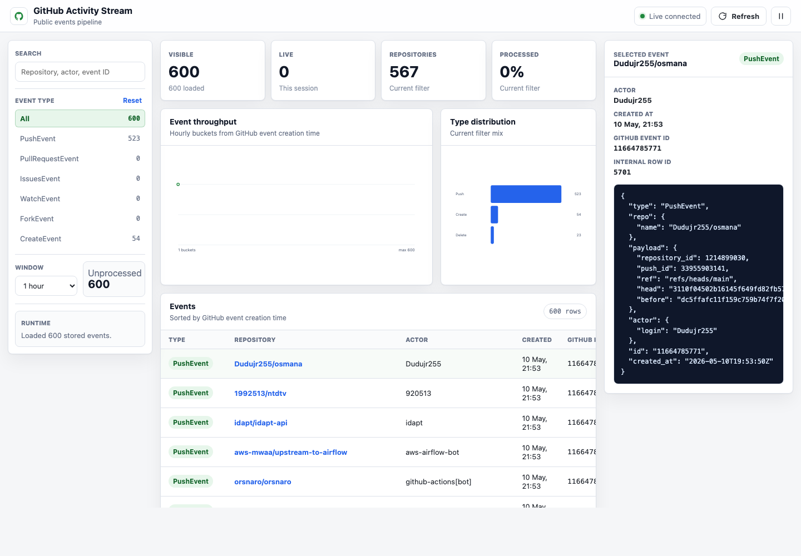
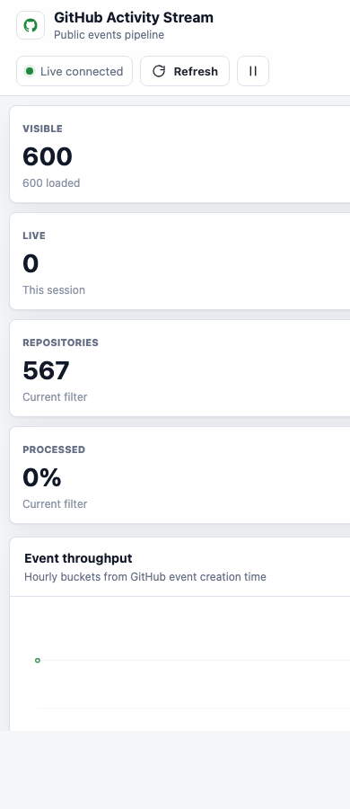

# GitHub Activity Stream

A Spring Boot application that streams public GitHub activity in near real time. It polls the GitHub public events API, publishes events to Kafka, consumes them back into the application, stores them in PostgreSQL, exposes query endpoints, and broadcasts live updates to a small browser dashboard through WebSockets.

The project is designed with production-oriented backend practices in mind, with a focus on reliable event processing, clear operational behavior, and maintainable service boundaries.

## What It Does

- Polls `https://api.github.com/events` every 5 seconds.
- Publishes each GitHub event to the Kafka topic `github-public-events`.
- Consumes Kafka messages and persists them to PostgreSQL.
- Stores GitHub's original event ID and `created_at` timestamp for stable deduplication and accurate event-time queries.
- Broadcasts live event payloads to WebSocket subscribers on `/topic/github-events`.
- Exposes REST endpoints for querying stored events by page, repository, type, recency, and processing state.
- Serves a modular static operations dashboard from `src/main/resources/static`.

## Tech Stack

- Java 21
- Spring Boot 4
- Spring Web MVC
- Spring WebSocket with STOMP and SockJS
- Spring for Apache Kafka
- Spring Data JPA
- PostgreSQL
- Flyway
- MapStruct
- Lombok
- Maven
- Docker Compose

## Architecture

```text
GitHub Public Events API
          |
          | scheduled poll every 5 seconds
          v
GitHubPublicEventsService
          |
          | Kafka message
          v
github-public-events topic
          |
          | @KafkaListener
          v
GitHubEventConsumer
          |
          +--> PostgreSQL github_events table
          |
          +--> WebSocket /topic/github-events
```

## Prerequisites

- JDK 21
- Docker and Docker Compose
- Maven wrapper support through `./mvnw`

You do not need to install Kafka or PostgreSQL locally. They are provided by `docker-compose.yaml`.

## Running Locally

Start Kafka, ZooKeeper, and PostgreSQL:

```bash
docker compose up -d
```

Run the application:

```bash
./mvnw spring-boot:run
```

If GitHub rate-limits your IP, provide a personal access token through an environment variable before starting the app:

```bash
export GITHUB_TOKEN=your_github_token
./mvnw spring-boot:run
```

Open the dashboard:

```text
http://localhost:8080
```

The dashboard loads recent stored events immediately and then subscribes to live WebSocket updates. If the screen is empty, check that Docker Compose is running, the Spring Boot app is running, and GitHub is not currently rate-limiting the poller.

The application expects:

- Kafka at `localhost:9092`
- PostgreSQL at `localhost:5433`
- Database name `github_events`
- Database user `postgres`
- Database password `password`

These defaults are defined in `src/main/resources/application.yaml` and `docker-compose.yaml`.
The GitHub poller also supports optional authentication and poll tuning through `github.public-events.*` properties.

## API Endpoints

Base path:

```text
/api/v1/events
```

List events with pagination:

```http
GET /api/v1/events?page=0&size=10
```

Find events by repository name:

```http
GET /api/v1/events/repo?repoName=owner/repository
```

Find events by GitHub event type:

```http
GET /api/v1/events/type?type=PushEvent
```

Find recent events:

```http
GET /api/v1/events/recent?hours=1
```

Find unprocessed events:

```http
GET /api/v1/events/unprocessed
```

## WebSocket Endpoint

The WebSocket endpoint is:

```text
/ws
```

Clients subscribe to:

```text
/topic/github-events
```

## Dashboard

The static dashboard uses SockJS and STOMP to receive live events in the browser. It also loads recent stored events from the REST API, supports filtering by event type, text search, time range, and processing state, and shows summary metrics, charts, a table, and a detail panel for selected events.

Desktop view:



Mobile view:



Current dashboard capabilities:

- Loads recent historical events from `/api/v1/events/recent`.
- Receives live events through `/topic/github-events`.
- Shows visible events, live events received in the current browser session, repository count, and processed percentage.
- Charts event throughput by GitHub creation time and event type distribution.
- Filters by event type, text search, time window, and unprocessed state.
- Displays a selectable events table with event type, repository, actor, GitHub creation time, GitHub event ID, and processing status.
- Shows an event inspector with repository, actor, GitHub event ID, internal row ID, and formatted payload JSON.
- Supports pausing live updates in the browser without stopping ingestion.

The dashboard is intentionally split into small frontend modules:

- `index.html` defines the application shell.
- `css/theme.css` defines reusable color, spacing, and typography tokens.
- `css/layout.css` defines page-level structure and responsive behavior.
- `css/components.css` defines dashboard component styling.
- `js/api.js` handles REST API calls.
- `js/state.js` owns client-side filter and event state.
- `js/views.js` renders dashboard sections.
- `js/charts.js` renders lightweight SVG charts.
- `js/format.js` centralizes display formatting.
- `js/app.js` wires fetch, WebSocket streaming, events, and refresh behavior.

## Database

Flyway creates the `github_events` table on startup.

Stored fields include:

- `id`
- `github_event_id`
- `type`
- `repo_name`
- `actor_login`
- `created_at`
- `payload`
- `processed`

Indexes are created for common lookups by repository, GitHub event ID, event type, creation time, and processing state.

Existing local databases are upgraded through Flyway. The second migration adds `github_event_id` for databases created before GitHub event metadata was persisted.

## Running Tests

```bash
./mvnw test
```

The test profile uses an in-memory H2 database, disables Flyway, disables the scheduled GitHub poller, and prevents Kafka listeners from auto-starting.

Current coverage includes mapper tests, event query service tests, GitHub public event polling tests, REST controller tests, application context loading, and consumer persistence tests for processed events and duplicate GitHub event IDs.

## Useful Development Commands

Start dependencies:

```bash
docker compose up -d
```

Stop dependencies:

```bash
docker compose down
```

Stop dependencies and remove the PostgreSQL volume:

```bash
docker compose down -v
```

Run the application:

```bash
./mvnw spring-boot:run
```

Run tests:

```bash
./mvnw test
```

## Project Structure

```text
src/main/java/me/manulorenzo/github_activity_stream
├── config       # RestTemplate and WebSocket configuration
├── controller   # REST API endpoints
├── domain       # GitHub API event model
├── dto          # API response DTOs
├── entity       # JPA entities
├── event        # Kafka consumers
├── mapper       # MapStruct mappers
├── repository   # Spring Data repositories
└── service      # GitHub polling and event query logic

src/main/resources
├── application.yaml
├── db/migration
└── static
    ├── index.html
    ├── css
    │   ├── theme.css
    │   ├── layout.css
    │   └── components.css
    └── js
        ├── api.js
        ├── app.js
        ├── charts.js
        ├── format.js
        ├── state.js
        └── views.js

docs/images
├── dashboard-desktop.png
└── dashboard-mobile.png
```

## Configuration Notes

The scheduled GitHub polling service is controlled by:

```yaml
github:
  public-events:
    enabled: true
    api-url: https://api.github.com/events
    poll-interval: 5s
    api-version: 2022-11-28
    user-agent: github-activity-stream
    auth-token: ${GITHUB_TOKEN:}
```

It is enabled by default. Set it to `false` in a profile if you want to run the app without polling GitHub.

For public-repo safety, the default configuration does not require a token and reads `GITHUB_TOKEN` only if you provide it in the environment. This keeps secrets out of the repository while allowing authenticated requests when you need GitHub's higher rate limit.

When GitHub returns a rate-limit response, the poller now reads `Retry-After` and `X-RateLimit-Reset` headers and pauses until GitHub says it can resume. According to GitHub's REST API docs, unauthenticated requests are typically limited to 60 requests per hour per IP, while authenticated requests typically get 5,000 requests per hour. Sources: https://docs.github.com/rest/using-the-rest-api/rate-limits-for-the-rest-api?apiVersion=2022-11-28 and https://docs.github.com/en/rest/rate-limit

## Completed Improvements

These roadmap items are now implemented:

- Store GitHub's public event ID in `github_event_id`.
- Store GitHub's API `created_at` timestamp instead of the local ingestion timestamp.
- Expose the GitHub event ID in API and WebSocket response DTOs.
- Deduplicate GitHub events by GitHub event ID before storing repeated poll results.
- Run Flyway migrations through Spring Boot 4's Flyway starter and PostgreSQL database module.
- Move database migrations into Spring Boot's default `db/migration` Flyway location.
- Replace the Kafka consumer's `System.err.println` and stack trace printing with structured logging.
- Improve the dashboard with recent historical loading, live updates, filters, metrics, charts, table selection, event detail views, and modular frontend code.
- Add README screenshots for desktop and mobile dashboard states.
- Add event query service tests for pagination, repository, type, recency, and processing-state lookups.
- Add GitHub public event polling tests for Kafka publishing, empty responses, HTTP failures, and rate-limit backoff.
- Add Kafka consumer tests for processed event persistence, duplicate GitHub event IDs, invalid JSON, missing GitHub event IDs, missing required stored fields, and invalid event timestamps.

## Future Improvements

The list below is prioritized by correctness, resilience, and operational value. Start with the high-priority items before moving into broader platform improvements.

### Priority 1: Correctness and Data Integrity

These are the most important next improvements because they directly affect confidence in stored data and the ability to change the application safely.

- Add consumer tests for WebSocket broadcast behavior and the database-constraint duplicate race path.
- Add end-to-end integration tests with Testcontainers for Kafka and PostgreSQL.

### Priority 2: Resilience and Operations

These improvements strengthen runtime behavior under failure conditions and make the service easier to operate in production.

- Add retry and backoff behavior for Kafka publishing failures and other transient failures.
- Add a dead-letter topic for events that cannot be deserialized or persisted.
- Define the meaning of the `processed` field beyond ingestion, then add workflows that move events through those processing states.

### Priority 3: Observability and API Usability

These make the application easier to operate, inspect, and consume.

- Add metrics with Spring Boot Actuator and Micrometer.
- Add OpenAPI documentation for the REST API.
- Add filtering by actor login and full-text search over payloads.
- Add database migration examples for schema changes beyond the initial table.

### Priority 4: Frontend and User Experience

These are useful once the backend behavior is stable.

- Add stronger dashboard reconnect handling and pagination for large stored event sets.
- Add richer dashboard charts for repository and actor trends.
- Add deep links for selected events and saved filter presets.

### Priority 5: Packaging, Security, and Advanced Topics

These are valuable later-stage improvements for production-readiness and deeper learning.

- Add Dockerfile support so the whole application can run through Docker Compose.
- Add authentication or admin-only controls before exposing operational actions.
- Explore Kafka message schemas with Avro, JSON Schema, or Protobuf.
- Add environment-specific configuration for local, test, CI, and production profiles.
- Extend the existing GitHub Actions workflow with dependency review, code coverage, and container image builds.

## Current Scope

This service focuses on a clear, maintainable event-ingestion pipeline rather than a full GitHub analytics platform. The current implementation prioritizes a small operational surface area, straightforward deployment, and incremental hardening over broad product scope.
